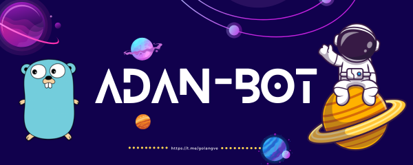

<div align="center">
  <picture>
    <source media="(prefers-color-scheme: dark)" srcset="doc/Adan-bot.png" height="240">
    
  </picture>
</div>

<div align="center">

[Report Bug]("https://github.com/Golang-Venezuela/adan-bot/issues/new?assignees=&labels=bug+P%3F&projects=&template=bug-report.md&title=") | [Request Feature](https://github.com/Golang-Venezuela/adan-bot/issues/new?assignees=&labels=&projects=&template=feature-request.md&title=)

</div>

[![Contributors][contributors-shield]][contributors-url]
[![Forks][forks-shield]][forks-url]
[![Stargazers][stars-shield]][stars-url]
[![Issues][issues-shield]][issues-url]
[![MIT License][license-shield]][license-url]
![codeQL][codeQL-shield]

[contributors-shield]: https://img.shields.io/github/contributors/Golang-Venezuela/adan-bot.svg?style=flat&logo=github
[contributors-url]: https://github.com/Golang-Venezuela/adan-bot/graphs/contributors
[forks-shield]: https://img.shields.io/github/forks/Golang-Venezuela/adan-bot.svg?style=flat&logo=github
[forks-url]: https://github.com/Golang-Venezuela/adan-bot/network
[stars-shield]: https://img.shields.io/github/stars/Golang-Venezuela/adan-bot.svg?style=flat&logo=github
[stars-url]: https://github.com/Golang-Venezuela/adan-bot/stargazers
[issues-shield]: https://img.shields.io/github/issues/Golang-Venezuela/adan-bot.svg?style=flat&logo=github
[issues-url]: https://github.com/Golang-Venezuela/adan-bot/issues
[license-shield]: https://img.shields.io/github/license/Golang-Venezuela/adan-bot?svghttps://go.dev/
[license-url]: https://github.com/Golang-Venezuela/adan-bot/blob/main/LICENSE

[![telegram-shield][telegram-shield]][telegram-url]
[![discord-shield][discord-shield]][discord-group-url]

[telegram-shield]: https://img.shields.io/badge/Chat_On-Telegram-017cb7?style=flat&logo=Telegram&logoColor=white
[telegram-url]: https://t.me/golangve
[discord-shield]: https://img.shields.io/discord/1160309089792954508
[discord-group-url]: https://discord.com/channels/1160309089792954508/1160309090250149958
</div>

Adan-Bot is the first bot in the community (hence its name) that will evolve, gradually acquiring numerous implicit features, making it increasingly better.

## Installation

### From source

Use the Go toolchain to fetch the module.

```shell
go install github.com/Golang-Venezuela/adan-bot/cmd/adan-bot
```

> [!IMPORTANT]
> You need to add Go installed binaries directory to your `PATH`.

```shell
export PATH="$(go env "GOPATH")/bin:$PATH"
```

## How to run

```shell
TELEGRAM_APITOKEN="YOUR_BOT_TOKEN" adan-bot
```

## Features

- [x] Hola Mundo.
- [ ] Events calendar.
- [ ] Structure of the repo.
- [ ] Captcha for new users. (ref. join captcha bot)
- [ ] Create databases (Validate SurrealDB) with the members of the Group
- [ ] Notification to the group when a PR is created
- [ ] Notification of new deploy
- [ ] Remove and ban users

## CI/CD

- [x] Add Contributing sections
- [x] Automatic CHANGELOG
- [x] Add Linter pipeline
- [ ] Test with coverage (50%)

## Built With

- [![Go][Go]][Go-url]
- [![telegram-api][telegram-api]][telegram-api-url]
- [![Docker][Docker-shield]][Docker-url]

[Go]: https://img.shields.io/badge/Go-3498DB?style=flat&logo=Go&logoColor=white
[Go-url]: https://go.dev/
[telegram-api]: https://img.shields.io/badge/telegram-api-017cb7?style=flat&logo=telegram&logoColor=white
[telegram-api-url]: https://core.telegram.org/bots/api
[codeQL-shield]: https://github.com/ossf/scorecard/workflows/CodeQL/badge.svg?branch=main
[Docker-shield]: https://img.shields.io/badge/docker-003f8c?style=flat&logo=docker&logoColor=white
[Docker-url]: https://www.docker.com/

## Contributing

See [contribution guide](CONTRIBUTING.md) for more information.

## License

Distributed under the MIT License. See [LICENSE](LICENSE) file for more
information.
